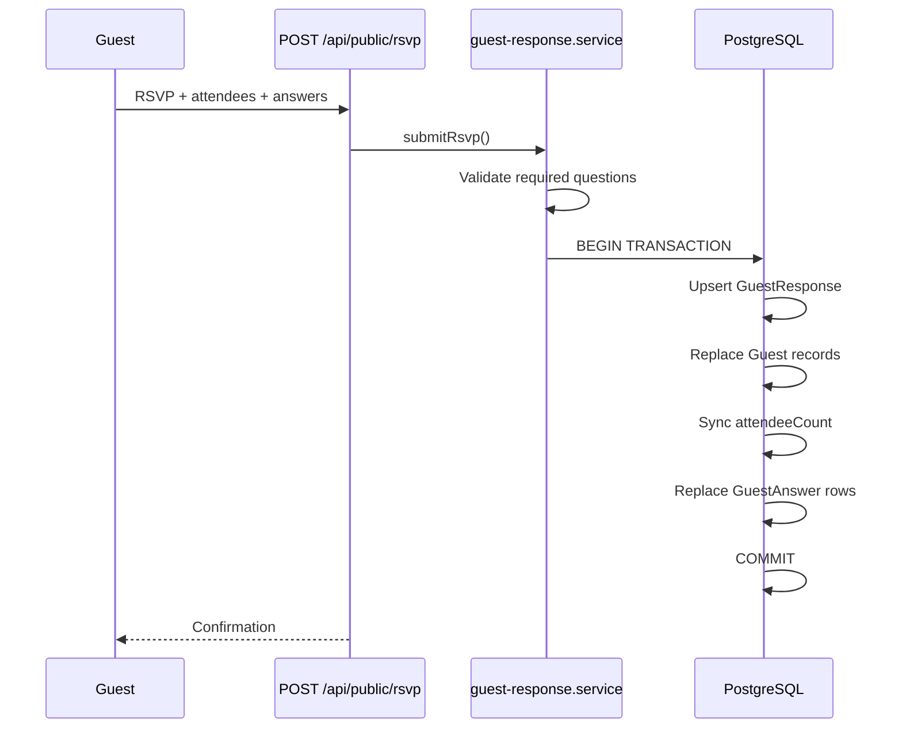
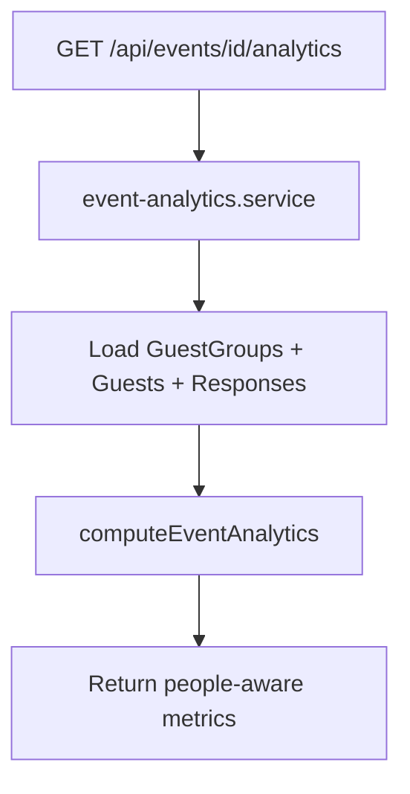

# Event Invitation Builder — Technical Specification v2.0

> **Stack:** Next.js 15 · TypeScript · Tailwind CSS · PostgreSQL · Prisma · Firebase Auth · Cloudinary · Recharts  
> **Status:** Architecture approved — ready for UI implementation phase.

---

## 1. System Overview

InviteEvents is a full-stack platform for creating digital event invitations with:

- **Guest groups** — one RSVP can represent couples, families, or friend groups
- **Attendee tracking** — adult/child counts for venue, catering, and seating
- **Dynamic survey builder** — 7 question types with unlimited options
- **Dedicated analytics** — event-level and survey-level metrics with Recharts
- **CSV export** — guest list, RSVP responses, survey answers

---

## 2. Entity Relationship Diagram

```mermaid
erDiagram
    User ||--o{ Event : owns
    TemplateCategory ||--o{ Template : contains
    Template ||--o{ Event : styles
    Event ||--|| InvitationDesign : has
    Event ||--o{ GuestGroup : invites
    Event ||--o{ Guest : contains
    Event ||--o{ GuestResponse : receives
    Event ||--o{ Question : defines
    Event ||--o{ GuestAnswer : stores
    Event ||--o{ EventMedia : has

    GuestGroup ||--o{ Guest : includes
    GuestGroup ||--o| GuestResponse : submits
    GuestGroup ||--o{ GuestAnswer : provides
    GuestGroup ||--o| Guest : "primary guest"

    Guest ||--o{ GuestAnswer : answers
    Question ||--o{ QuestionOption : has
    Question ||--o{ GuestAnswer : receives
    QuestionOption ||--o{ GuestAnswer : selected_in
    GuestResponse ||--o{ GuestAnswer : includes

    GuestGroup {
        string id PK
        string eventId FK
        string groupName
        string primaryGuestId FK
        int attendeeCount
        string inviteToken UK
        enum inviteStatus
    }

    Guest {
        string id PK
        string groupId FK
        string eventId FK
        string name
        enum attendeeType
        boolean isPrimary
    }

    GuestResponse {
        string id PK
        string groupId FK UK
        string eventId FK
        enum response
        datetime respondedAt
    }

    Question {
        string id PK
        string eventId FK
        enum type
        string title
        string description
        boolean required
        int sortOrder
    }

    QuestionOption {
        string id PK
        string questionId FK
        string label
        string value
        int sortOrder
    }

    GuestAnswer {
        string id PK
        string groupId FK
        string guestId FK
        string questionId FK
        string eventId FK
        string optionId FK
        string textValue
        decimal numberValue
        boolean boolValue
    }
```

---

## 3. Prisma Models

Full schema: `prisma/schema.prisma`

### 3.1 Core Models

| Model | Purpose |
|-------|---------|
| `User` | Firebase identity mirror |
| `Event` | Invitation entity with slug, schedule, theme |
| `GuestGroup` | RSVP unit — couple, family, friends |
| `Guest` | Individual attendee (Adult / Child) |
| `GuestResponse` | Group-level RSVP status |
| `Question` | Survey question |
| `QuestionOption` | Choice option (unlimited per question) |
| `GuestAnswer` | Atomic answer value |

### 3.2 Relationships

```
Event 1──* GuestGroup
Event 1──* Guest
Event 1──* GuestResponse
Event 1──* Question
Event 1──* GuestAnswer

GuestGroup 1──* Guest
GuestGroup 1──1 GuestResponse
GuestGroup 1──* GuestAnswer
GuestGroup 1──0..1 Guest (primaryGuest)

Guest 1──* GuestAnswer
Question 1──* QuestionOption
Question 1──* GuestAnswer
QuestionOption 1──* GuestAnswer (optional)
GuestResponse 1──* GuestAnswer
```

### 3.3 Enums

```typescript
enum QuestionType {
  TEXT            // Single-line input
  TEXTAREA        // Multi-line input
  SINGLE_CHOICE   // Radio
  MULTIPLE_CHOICE // Checkbox
  YES_NO          // Boolean
  NUMBER          // Numeric
  SELECT          // Dropdown
}

enum AttendeeType {
  ADULT
  CHILD
}

enum RsvpResponse {
  ATTENDING
  NOT_ATTENDING
  MAYBE
}
```

### 3.4 GuestAnswer Storage Rules

| Question Type | Storage | Rows per group |
|---------------|---------|----------------|
| TEXT, TEXTAREA | `textValue` | 1 |
| NUMBER | `numberValue` | 1 |
| YES_NO | `boolValue` | 1 |
| SINGLE_CHOICE, SELECT | `optionId` | 1 |
| MULTIPLE_CHOICE | `optionId` per selection | N |

**Uniqueness:** `@@unique([groupId, questionId, optionId])`

Partial index (migration SQL) for single-value answers:

```sql
CREATE UNIQUE INDEX guest_answers_single_value_idx
  ON guest_answers (group_id, question_id)
  WHERE option_id IS NULL;
```

### 3.5 GuestGroup.attendeeCount

Denormalized count of `Guest` records in the group. Synced on:

- Guest group create/update
- Public RSVP submission

Enables fast dashboard queries without joins.

---

## 4. Guest Group Architecture

### 4.1 Concept

One **GuestGroup** = one invitation / one RSVP link / one response.

Example — Family Smith:

| Guest | Type |
|-------|------|
| John Smith | Adult (primary) |
| Jane Smith | Adult |
| Emma Smith | Child |
| Lucas Smith | Child |

RSVP: **Attending**

Dashboard counts:
- 1 invitation (group)
- 1 RSVP response
- **4 confirmed attendees** (2 adults + 2 children)

### 4.2 Group Types Supported

| Type | Example | groupName |
|------|---------|-----------|
| Individual | Solo guest | null or guest name |
| Couple | John & Jane | "John & Jane" |
| Family | Smith Family | "Smith Family" |
| Friends | College friends | "The Crew" |

---

## 5. Analytics Architecture

### 5.1 Service Layer

```
src/services/
├── event-analytics.service.ts   # Event & dashboard metrics
├── survey-analytics.service.ts  # Per-question stats + chartData
└── export.service.ts            # CSV generation
```

```
src/lib/analytics/
└── event-stats.ts               # Pure compute functions
```

### 5.2 EventAnalytics (per event)

| Metric | Definition |
|--------|------------|
| `totalInvitations` | Guest group count |
| `totalInvitedAttendees` | Sum of all Guest records |
| `totalRsvpResponses` | Groups with GuestResponse |
| `totalConfirmedAttendees` | Guests in ATTENDING groups |
| `totalDeclinedAttendees` | Guests in NOT_ATTENDING groups |
| `totalMaybeAttendees` | Guests in MAYBE groups |
| `totalPendingAttendees` | Guests in groups without response |
| `totalAdultsAttending` | Adults in ATTENDING groups |
| `totalChildrenAttending` | Children in ATTENDING groups |
| `totalAttendees` | Alias for confirmed attendees |
| `responseRate` | Responses / invitations × 100 |
| `attendanceRate` | Confirmed / invited × 100 |

### 5.3 SurveyAnalytics (per question)

| Field | Description |
|-------|-------------|
| `totalAnswers` | Distinct groups that answered |
| `optionBreakdown` | Count + percentage per option |
| `chartData` | Recharts-ready `{ label, count, percentage, fill }[] |
| `numberStats` | min, max, avg for NUMBER type |
| `textResponses` | Sample text answers |

### 5.4 Recharts Integration

API returns `chartData` array pre-formatted for:

- `BarChart` — option counts
- `PieChart` — option percentages

Client renders using Recharts (UI phase).

---

## 6. CSV Export Architecture

### 6.1 Export Types

| Type | Endpoint | Contents |
|------|----------|----------|
| `guests` | `?type=guests` | All guests with group, type, RSVP status |
| `rsvp` | `?type=rsvp` | Group-level responses with adult/child breakdown |
| `survey` | `?type=survey` | Question answers pivoted by group |

### 6.2 Service

`export.service.ts` → `exportEventData(eventId, userId, type)`

Returns `{ csv, filename }` with proper escaping.

---

## 7. API Routes

### 7.1 Authentication

| Method | Path | Description |
|--------|------|-------------|
| POST | `/api/auth/session` | Verify Firebase token, set cookie |
| POST | `/api/auth/logout` | Clear session |

### 7.2 Events

| Method | Path | Description |
|--------|------|-------------|
| GET/POST | `/api/events` | List / create |
| GET/PATCH/DELETE | `/api/events/[eventId]` | CRUD |
| POST | `/api/events/[eventId]/publish` | Publish |
| POST | `/api/events/[eventId]/duplicate` | Duplicate |

### 7.3 Guest Groups

| Method | Path | Description |
|--------|------|-------------|
| GET/POST | `/api/events/[eventId]/guest-groups` | List / create groups |
| PATCH/DELETE | `/api/events/[eventId]/guest-groups/[groupId]` | Update / delete |

### 7.4 Survey / Questions

| Method | Path | Description |
|--------|------|-------------|
| GET/POST | `/api/events/[eventId]/questions` | List / create |
| PUT | `/api/events/[eventId]/questions/reorder` | Drag-and-drop order |
| GET/PATCH/DELETE | `/api/events/[eventId]/questions/[questionId]` | CRUD |
| POST | `/api/events/[eventId]/questions/[questionId]/options` | Add option |

### 7.5 Analytics

| Method | Path | Description |
|--------|------|-------------|
| GET | `/api/dashboard/stats` | Dashboard-level analytics |
| GET | `/api/events/[eventId]/analytics` | Event attendance metrics |
| GET | `/api/events/[eventId]/survey/analytics` | All question stats |
| GET | `/api/events/[eventId]/questions/[questionId]/analytics` | Single question |
| GET | `/api/events/[eventId]/answers` | Paginated answers + filters |

### 7.6 Export

| Method | Path | Description |
|--------|------|-------------|
| GET | `/api/events/[eventId]/export?type=guests` | Guest list CSV |
| GET | `/api/events/[eventId]/export?type=rsvp` | RSVP responses CSV |
| GET | `/api/events/[eventId]/export?type=survey` | Survey answers CSV |

### 7.7 Public

| Method | Path | Description |
|--------|------|-------------|
| GET | `/api/public/invite/[slug]` | Published event + questions |
| GET/POST | `/api/public/rsvp/[token]` | Token-based RSVP + survey |
| POST | `/api/public/rsvp` | Open RSVP by slug |

---

## 8. Service Layer

| Service | Responsibility |
|---------|----------------|
| `event.service.ts` | Event CRUD, publish, duplicate |
| `guest-group.service.ts` | Group CRUD, attendeeCount sync |
| `guest-response.service.ts` | RSVP submit, answer validation, list answers |
| `question.service.ts` | Question CRUD, reorder, options |
| `event-analytics.service.ts` | Event + dashboard analytics |
| `survey-analytics.service.ts` | Question stats, chartData |
| `export.service.ts` | CSV export (guests, rsvp, survey) |
| `template.service.ts` | Template listing |
| `media.service.ts` | Cloudinary media (future) |

---

## 9. Folder Structure

```
src/
├── app/
│   ├── (marketing)/           # Landing
│   ├── (auth)/login/          # Firebase auth
│   ├── (dashboard)/dashboard/ # Organizer UI (next phase)
│   ├── (public)/invite/       # Public invitation
│   └── api/                   # Route handlers
├── components/                  # UI (next phase)
├── lib/
│   ├── analytics/event-stats.ts
│   ├── prisma.ts
│   ├── firebase/
│   ├── cloudinary/
│   └── auth/
├── services/                    # Business logic
├── types/
│   ├── analytics.ts
│   └── index.ts
└── validations/                 # Zod schemas
prisma/
├── schema.prisma
├── seed.ts
└── migrations/
docs/
└── TECH_SPEC.md
```

---

## 10. Data Flows

### 10.1 RSVP + Survey Submit



### 10.2 Analytics Query



---

## 11. Implementation Phases

| Phase | Scope | Status |
|-------|-------|--------|
| 1 | Schema, services, API | ✅ Complete |
| 2 | UI — landing, auth, dashboard | 🔄 Next |
| 3 | UI — guest management, survey builder | Pending |
| 4 | UI — analytics (Recharts), export buttons | Pending |
| 5 | Public invitation polish | Pending |

---

*Document version: 2.0 · Architecture review complete*
